<div align="center">

# Falcon's Journey | رحلة الصقر

**A gamified learning path for Grade 4 students. UAE Heritage and Space Exploration, woven together with Khaleeji visual grammar and a souq economy.**

[](https://falcon-s-journey-through-science.vercel.app/)
&nbsp;
[](https://www.figma.com/design/1VJqRNglGuqraLQhokg1bN/Untitled?node-id=0-1&t=yvJCJFJkbIQoGouL-1)

<br/>


</div>

> Built for the **ADEK** (Abu Dhabi Department of Education and Knowledge) Frontend Developer (Interactive UI & Gamification) submission, April 2026.

> 🔗 **Live demo:** [falcon-s-journey-through-science.vercel.app](https://falcon-s-journey-through-science.vercel.app/) &nbsp;·&nbsp; **Figma design file:** [open in Figma](https://www.figma.com/design/1VJqRNglGuqraLQhokg1bN/Untitled?node-id=0-1&t=yvJCJFJkbIQoGouL-1)

<p align="center">
  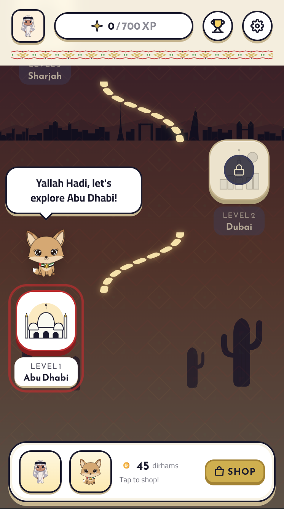
</p>

---

## What it is

Falcon's Journey is a mobile first learning app for Grade 4 students. The student picks a name, an avatar (from 10 Emirati and multicultural kids), and a UAE native companion (camel, falcon, oryx, sand cat, sand fox, hoopoe, sea turtle, or wolf), then walks a path of themed levels.

There are **two playable subjects** today:

* **🏛️ UAE Heritage** *(default. 7 levels, one per emirate)* · Abu Dhabi, Dubai, Sharjah, Ajman, Umm Al Quwain, Ras Al Khaimah, Fujairah.
* **🚀 Space Exploration** *(6 levels)* · Sun → Inner planets → Asteroid Belt → Outer planets → **Hope Probe** capstone.
* **🌱 Earth & Nature** is wired but disabled (Coming Soon).

Each level interleaves teaching cards with six exercise types: multiple choice, true or false, tap the image, match pairs (English ↔ Arabic vocab), listen and pick (Web Speech TTS in `en-US` and `ar`), and learn cards. Wrong answers cost a heart (5 max). Finishing a level with all 5 hearts intact, the *first time*, awards a perfect clear bonus of 5 dirhams.

Dirhams unlock items in the **Souq**, outfits for the player and their companion. The **Rewards Room** holds the badge gallery, a 3D rotating trophy (`@react-three/fiber` + `drei` + `postprocessing`), and the Master Explorer certificate (gated on completing every badge across every enabled subject).

---

## How it maps to the 5 evaluation criteria

| # | Criterion | Where to look |
|---|---|---|
| 1 | **UAE cultural integration** | The whole app is bilingual (Reem Kufi + Cairo). Sadu weaving, Arabesque borders, and the 8 point Khaleeji star are *system primitives* that appear in the loader, badges, dividers, and page chrome rather than as decoration. The default subject is **UAE Heritage** (one level per emirate). The Space subject's capstone celebrates the **Hope Probe** mission. Currency is **dirhams**. The shop is a **souq** with ghutra, cool glasses, and UAE collar items. Sticker library is ~187 entries: ghaf trees, dallah pots, dhows, palm fronds, every emirate skyline. |
| 2 | **Visual design quality** | A consistent "souq grammar" applied across every page (white surface · 2px navy border · 5px gold drop shadow · `inset 0 1px 0 rgba(255,255,255,0.55)` highlight). Custom 3D trophy room with bloom and ACES Filmic tone mapping. Cinematic parallax backdrops on both subject maps (a hand composed Dubai skyline, oasis, and dunes for Heritage; a painted solar system panorama, gas giants, and spiral galaxy for Space). All visual assets (companion SVGs, avatar PNGs, ~187 entry sticker library, badge medallions, the parallax backdrops, and the cool glasses outfit) are original and built for this project. |
| 3 | **UI/UX quality** | Mobile first design with deliberate touch behavior (the rewards page hold to peek doesn't trap vertical scroll on touch). Settings modal exposes sound, reduced motion, and Arabic numerals at runtime. Souq item rail scrolls horizontally on phone with arrow buttons; lays flat on desktop. Hold to peek lets locked content tease itself. Onboarding walks name → avatar → companion → subject in one continuous flow. |
| 4 | **Micro animations** | Custom **Khaleeji seal route loader** that draws a geometric seal stroke by stroke and reforms continuously (8 point star, arabesque petals, sadu thread rim). **InitialPaintLoader** renders a static SVG seal in the SSR HTML so a hard refresh never shows a blank screen during hydration. Streak celebrations at thresholds [3, 5, 7, 10] consecutive correct. Level complete confetti in UAE colors. Companion mood animations (idle, happy, thinking, flying). Per level Mars orbit scene in Space L6's intro. Every animation respects `prefers-reduced-motion`. |
| 5 | **Student journey flow** | A single onboarding flow funnels the student into their chosen subject's map. Locked levels are clearly gated; the next playable level pulses with a hint ring. Each lesson is paced (teach → test → teach → test) and never has more than about 3 question types in a row. Hearts give failure consequence without punishment (no harsh red, gentle shake, "try again" with the answer revealed). The economy keeps engagement going past the last lesson; there's always something new in the souq. |

---

## Quick start

```bash
git clone https://github.com/hadi14250/Falcon-s-Journey-Through-Science.git
cd Falcon-s-Journey-Through-Science
npm install
npm run dev          # http://localhost:3000

# other scripts
npm run build        # production build (Next.js + Turbopack)
npm run start        # serve the production build
npm run test         # Jest + React Testing Library
npm run test:watch   # watch mode
npm run test:coverage
npm run lint         # ESLint (next/core-web-vitals)
```

**Requirements:** Node 20+, npm. No backend, no auth, no Docker. All progress lives in the browser via Zustand `persist` middleware (key: `falcons-journey-storage`, version 5).

> 💡 **Reviewer tip:** the live demo persists progress to localStorage, so open it in a fresh private window to walk the full onboarding flow. To replay later, the in app **Profile** page has a Reset Progress action.

**Live demo:** **[falcon-s-journey-through-science.vercel.app](https://falcon-s-journey-through-science.vercel.app/)** &nbsp;·&nbsp; **Figma:** **[design file](https://www.figma.com/design/1VJqRNglGuqraLQhokg1bN/Untitled?node-id=0-1&t=yvJCJFJkbIQoGouL-1)**

---

## A short tour

### 1. Pick your character

<p align="center">
  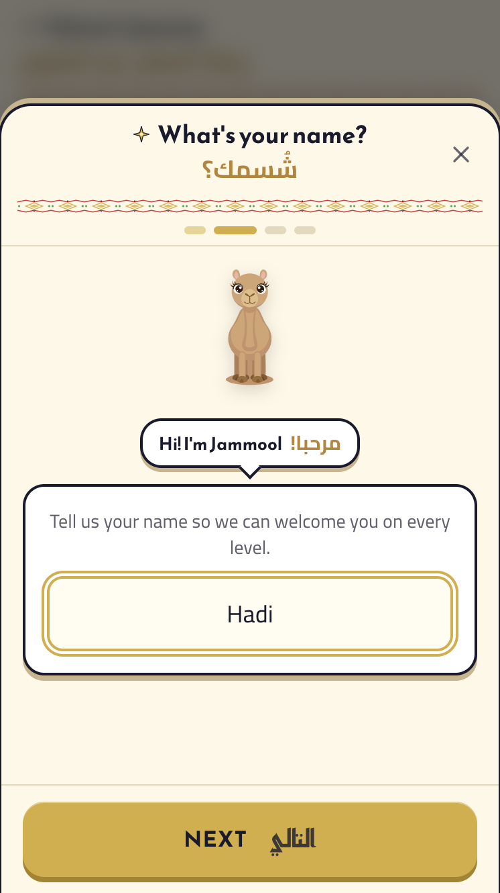
  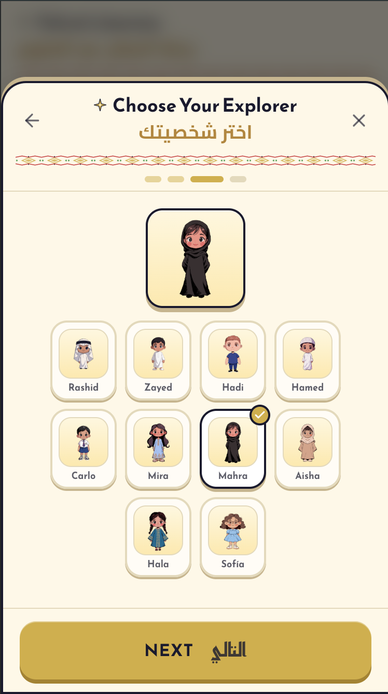
  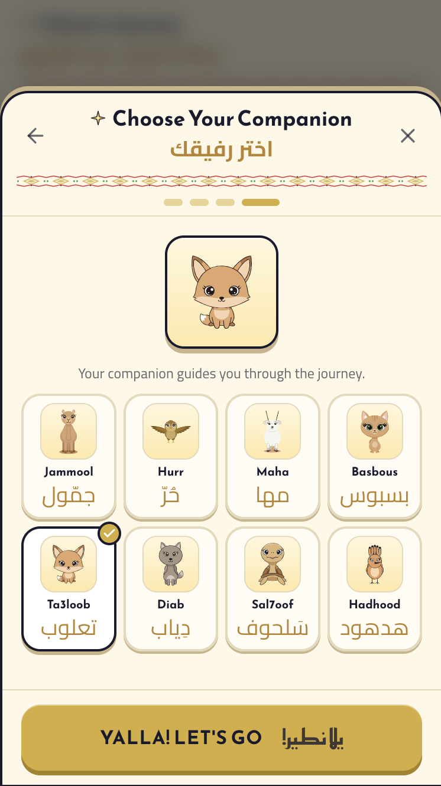
</p>

Name → avatar (10 options, Emirati kids in kandura/shayla plus Filipino and Latina kids) → companion (8 UAE native animals, each with a bilingual name like *Hurr* (حُرّ, "free") for the falcon, *Maha* (مها) for the oryx, *Sal7oof* (سَلحوف) for the sea turtle).

### 2. Walk the map

<p align="center">
  
  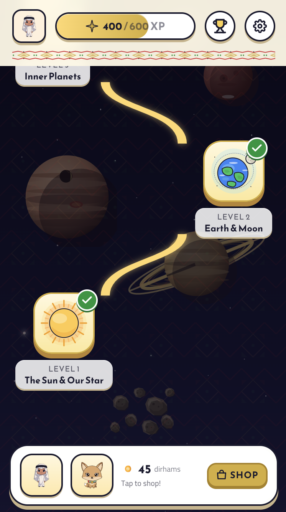
</p>

Each subject has its own map, biome, and theme color, with a cinematic parallax backdrop drawn for that subject. Heritage walks the player past a hand composed Dubai skyline, an oasis, and warm dunes. Space climbs from a sun on the horizon, through the inner planets and gas giants, up to a hand drawn spiral galaxy in the deep. A first visit spotlight tour points the player to the level node, the XP bar, the trophy room, and the dirhams shop, then never fires again (replayable from Settings → Help).

### 3. Play a level

<p align="center">
  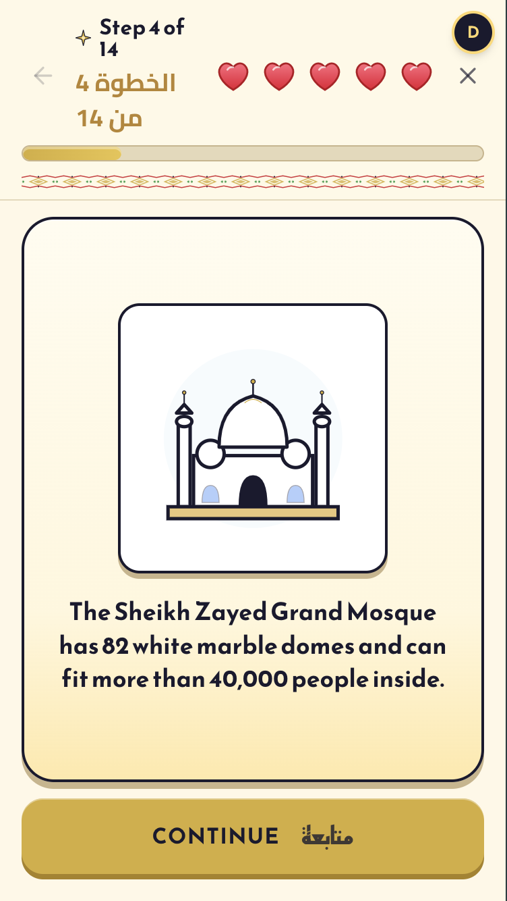
  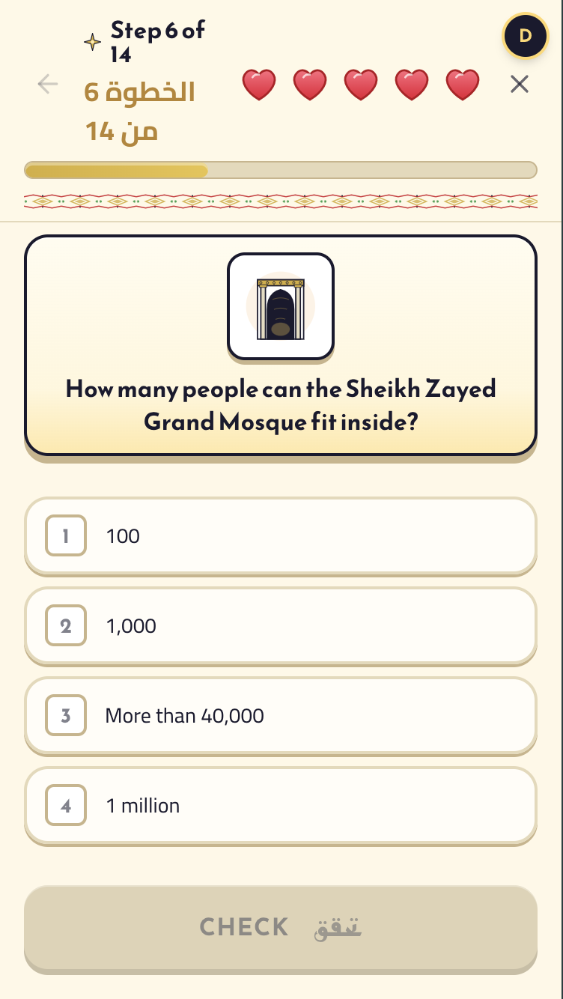
  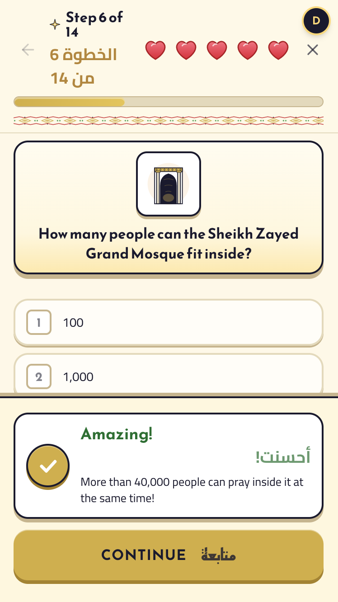
</p>

Hearts row (5 max) at top, exercise in the middle, feedback sheet between exercises with the companion's voice line. Six exercise types interleave throughout the lesson: learn, multiple choice, true or false, tap image, match pairs, listen and pick.

### 4. Level complete

<p align="center">
  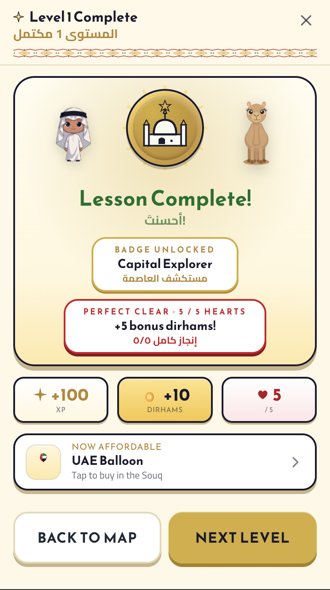
</p>

Hit 3, 5, 7, or 10 in a row inside a level and a streak celebration overlay flashes the player's run. Finish the level and you see score, dirhams, XP breakdown, badge unlock, and the **perfect clear bonus** if you cleared it without losing a heart.

### 5. Souq economy

<p align="center">
  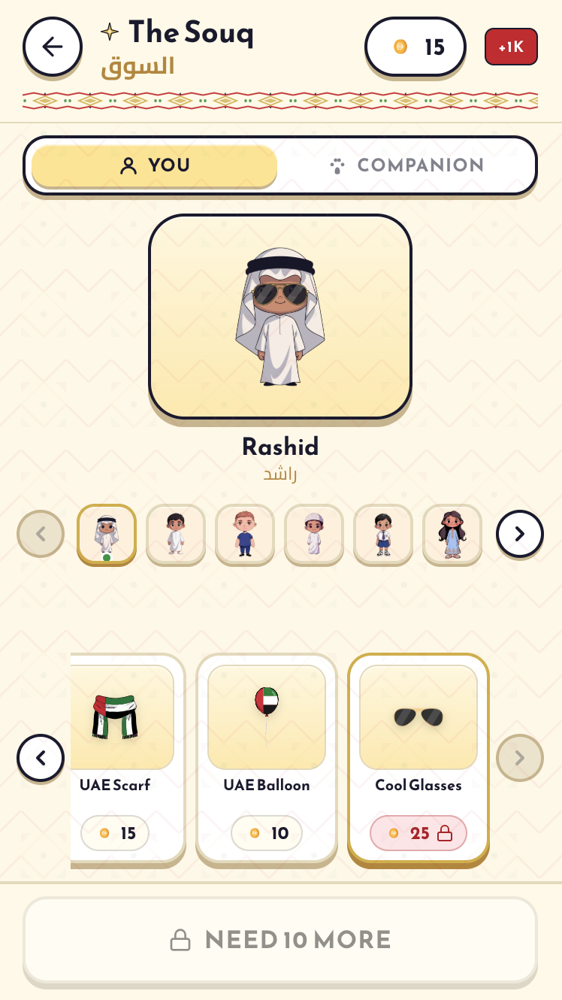
  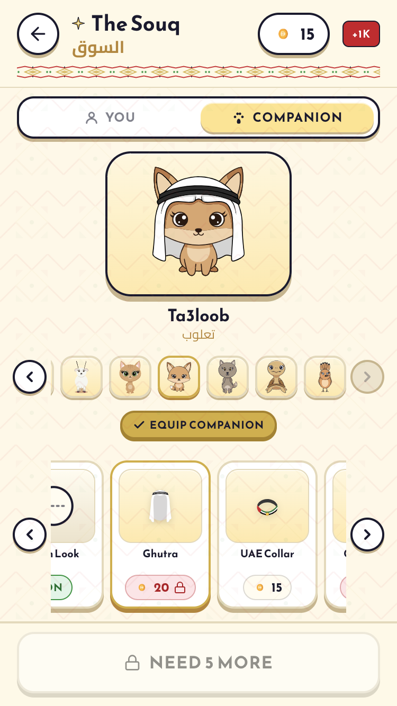
</p>

Two slots, **human** and **companion**, each can wear one item at a time. The slots are independent, so you can dress both at once. Items range from 10 to 25 dirhams. The newest item is **Cool Glasses** (25 dirhams), available in both human and companion variants.

### 6. View any character in 3D

<p align="center">
  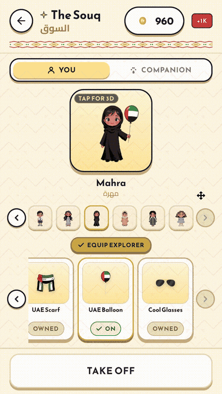
</p>

<p align="center">
  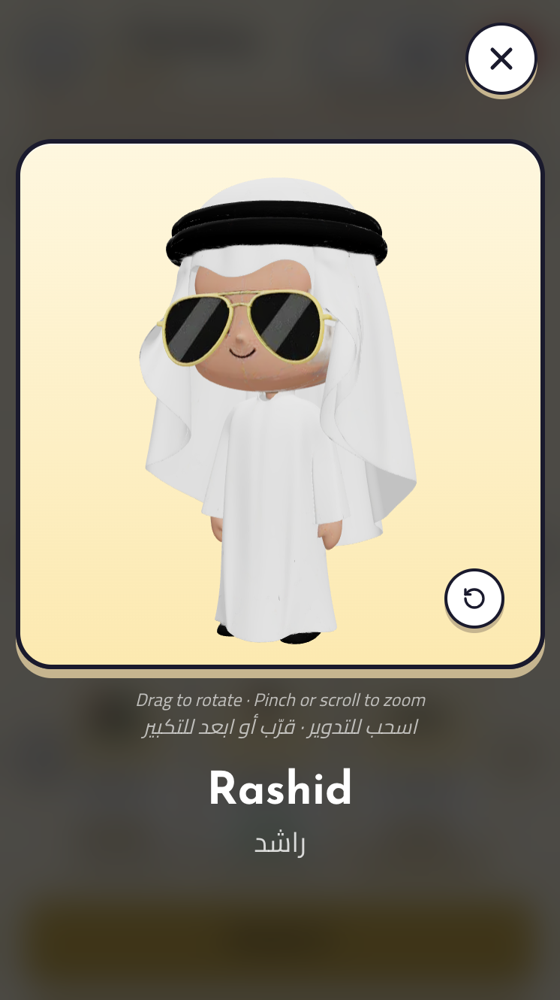
  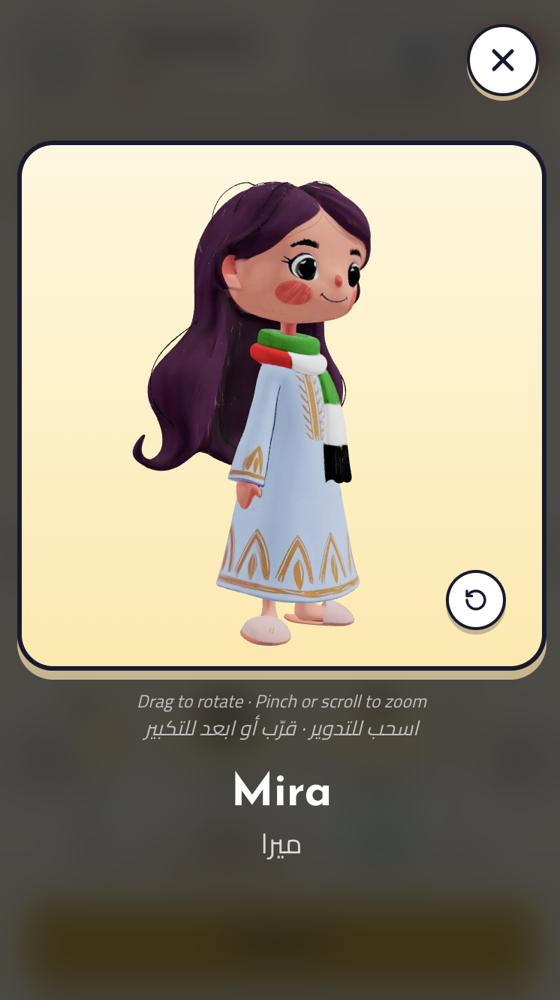
  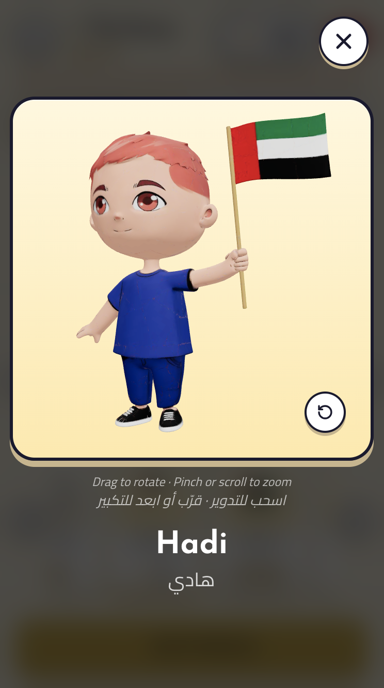
</p>

Tap any character on the **Profile** hero or the **Souq** stage and the lightbox opens with a fully rotatable 3D model of that character, in whatever outfit they're currently wearing. Every avatar × every outfit combination has its own GLB (50 models in total: 10 explorers × 5 looks each). The viewer is `@react-three/fiber` + `drei` driven, lazy loaded so the Three.js bundle only ships when a player actually opens a 3D view.

Drag rotates on Y, pinch or scroll zooms (clamped so the model can't get lost). After 4 seconds of inactivity the camera auto snaps back to the front facing default; a small reset puck pinned to the bottom right does the same on demand. When the user isn't dragging, the model gently sways ±6° on Y so it never feels frozen. A spinning gold "3D" pill in the corner of the avatar card flags which characters have the 3D view (so it's discoverable without copy clutter); the card also tilts on hover (perspective + rotateY) on desktop so the 3D nature is implicit.

GLBs are Draco + WebP compressed and served from `/public/models/` (avg ~1MB each). The drei loader auto wires Draco / Meshopt decoders, no manual setup. Every character variant is normalized to the same scale via a runtime bounding box auto fit, so the model always fills the viewer regardless of how Meshy exported it.

### 7. Rewards Room

<p align="center">
  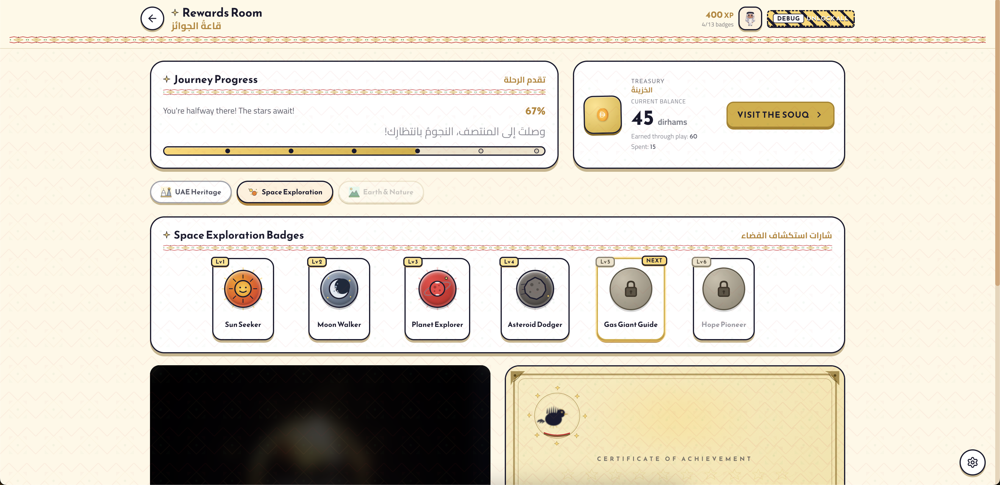
</p>

<p align="center">
  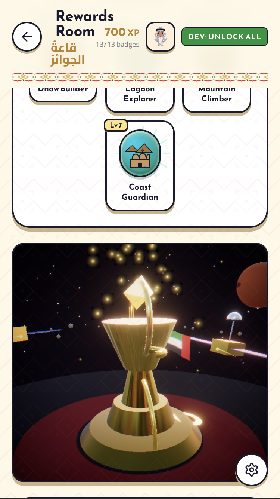
  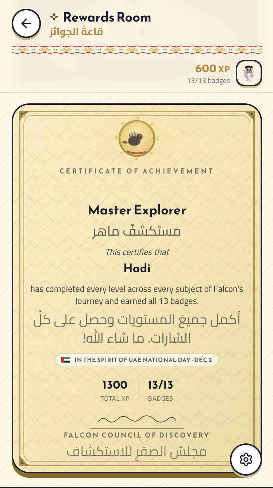
  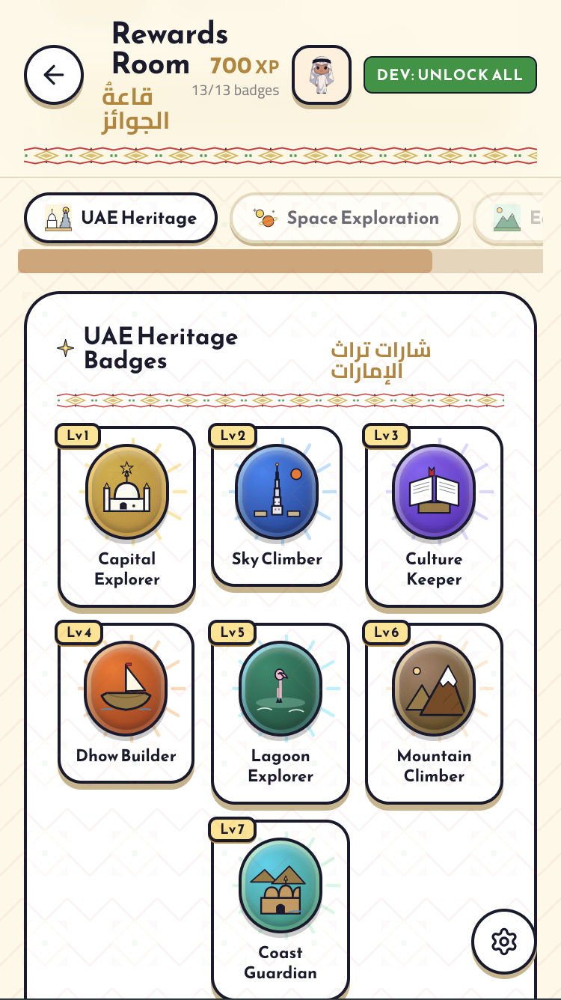
</p>

On desktop the page reflows into a real layout: Journey Progress and Treasury sit side by side at the top, the badge grid expands to seven columns (so all seven Heritage badges fit in one row), and the trophy and certificate sit as a 50/50 pair. The next available badge gets a gold border, a pulsing ring, and a NEXT tag inline in the grid. The certificate uses a graduated reveal so the player's name and the Master Explorer title stay sharp while the body, seal, and signature blur until earned.

Three.js scene rendered with `@react-three/fiber` + `drei` + `postprocessing`: bloom, ACES Filmic tone mapping, three Hope Probes orbiting (one polar), Saturn + Earth + Mars drifting in the distance, a tumbling asteroid belt, shooting stars. Click the trophy to zoom in. Locked content uses **hold to peek** on touch and **hover to peek** on mouse, so the player can tease what they're working toward without leaving the page. The scene is lazy mounted on scroll into view and pauses its render loop when offscreen or in a backgrounded tab so it does not eat GPU when the player is not looking at it.

### 8. Profile + Settings

<p align="center">
  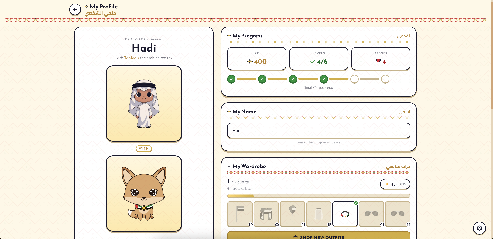
</p>

<p align="center">
  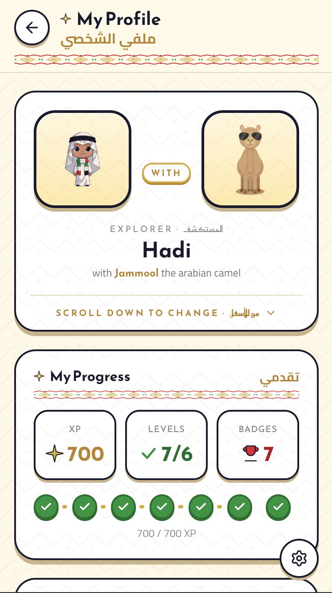
  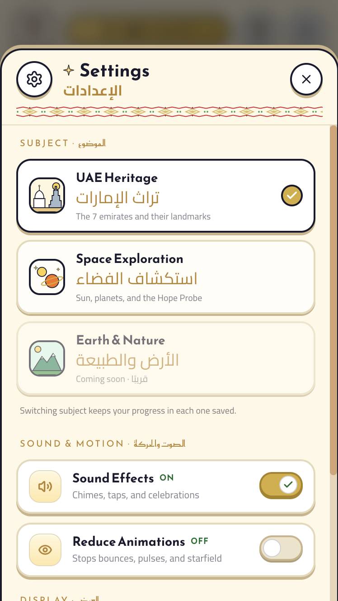
</p>

Profile shows name, avatar, companion, equipped items, owned items, and total XP. On desktop the page reflows into a two column layout with the hero (avatar + companion + name) anchored on the left and the progress, name, and wardrobe cards stacked on the right. Tapping the hero scrolls down to the Choose Your Explorer section. The Explorer picker fits ten avatars as a 5×2 grid; the Companion picker fits eight as 5+3 with the orphan trio centered. Wardrobe items show three states: locked (grayscale with a padlock corner), owned, and equipped (green checkmark). Settings exposes sound on/off, reduced motion on/off, Arabic numerals, and a Replay Tour control. All persist in the same Zustand store as the game state.

### 9. Loader

<p align="center">
  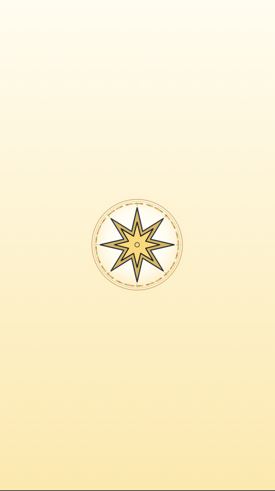
</p>

The route transition loader draws an 8 point Khaleeji seal stroke by stroke, with a sadu thread rim sweeping around it in red, gold, and green. A second variant, the **InitialPaintLoader**, renders a static version of the same seal in the SSR HTML so a hard browser refresh paints something themed before the JS bundle arrives. Both respect `prefers-reduced-motion`.

---

## Tech stack

| Tech | Version | What it does here |
|---|---|---|
| **Next.js** | 16.2.4 | App Router, Turbopack, route segment loaders + transitions |
| **React** | 19.2.4 | UI library |
| **TypeScript** | strict | Type safety end to end (no `any`) |
| **Tailwind CSS** | v4 | Custom desert and space palette, design tokens |
| **Framer Motion** | 12 | Every animation + `useReducedMotion` + `MotionConfig` |
| **Zustand** | 5 | Persisted state (key: `falcons-journey-storage`, version 5) |
| **@react-three/fiber** | 9 | React renderer for Three.js |
| **@react-three/drei** | 10 | OrbitControls, Stars, Sparkles, Trail |
| **@react-three/postprocessing** | 3 | Bloom, Vignette, ACES tone mapping (skipped under reduced motion) |
| **three** | 0.184 | 3D core |
| **Lucide React** | 1 | Icon set |
| **Reem Kufi + Cairo** | Google Fonts | Bilingual headings (display) + body (true Arabic and Latin support) |
| **Web Audio API** | native | 9 procedurally generated UI sounds (no audio files shipped) |
| **Web Speech API** | native | Text to speech for `listen-pick` exercises (en US + ar) |
| **Jest + RTL** | 30 / 16 | Unit + component + smoke tests (24 test files) |

No external API. No backend. No Docker.

---

## Project structure

```
src/
├── app/
│   ├── page.tsx                 # Onboarding + subject picker (home)
│   ├── layout.tsx               # Root layout, fonts, providers
│   ├── loading.tsx              # Route segment loader (DhowLoader)
│   ├── map/                     # Journey map per subject
│   ├── level/[id]/              # Lesson runner (LessonShell)
│   ├── rewards/                 # Trophy, certificate, badge gallery
│   ├── profile/                 # Avatar/companion/equipped/owned
│   └── souq/                    # Shop with two slot equip system
│
├── components/
│   ├── SettingsProvider.tsx     # Reduced motion + sound runtime wiring
│   ├── lesson/
│   │   ├── LessonShell.tsx      # Drives a level's exercise sequence
│   │   ├── exercises/           # learn, mcq, true or false, tap image,
│   │   │                        #   match pairs, listen and pick
│   │   ├── Sticker.tsx          # 187 entry sticker library
│   │   ├── HeartRow.tsx         # 5 hearts visual
│   │   ├── FeedbackSheet.tsx    # Between exercise feedback
│   │   ├── StreakCelebration.tsx
│   │   ├── HeartsOutOverlay.tsx
│   │   └── LessonComplete.tsx
│   ├── map/                     # JourneyMap, LevelNode, mission card
│   ├── mascot/                  # Companion + per species SVG art
│   ├── three/TrophyScene.tsx    # 3D trophy room (R3F + postprocessing)
│   ├── ui/
│   │   ├── DhowLoader.tsx       # Khaleeji seal route loader
│   │   ├── InitialPaintLoader.tsx  # SSR paint variant
│   │   ├── RouteTransition.tsx  # Provider + navigate() helper
│   │   ├── SettingsModal.tsx
│   │   ├── BadgeMedallion.tsx
│   │   ├── FalconCrest.tsx
│   │   ├── UaeAccent.tsx        # SaduBand, KhaleejiStar
│   │   └── ...
│   ├── patterns/                # SaduPattern, ArabesqueBorder, GrainTexture
│   └── onboarding/NamePrompt.tsx
│
├── data/
│   ├── subjects.ts              # heritage, space, nature
│   ├── companions.ts            # 8 companions with EN+AR names
│   ├── avatars.ts               # 10 avatars (5 boys, 5 girls)
│   ├── lessons/{heritage,space,nature}.ts
│   ├── levels/{heritage,space}.ts
│   ├── badges.ts
│   └── shop.ts                  # Souq items + variant resolvers
│
└── lib/
    ├── store.ts                 # Zustand store (the game state)
    ├── sounds.ts                # 9 Web Audio API sounds
    └── numerals.ts              # Arabic ↔ Latin numeral conversion

__tests__/                       # 24 test files (data, components, lib)
public/
├── humans/{plain,flag,scarf,balloon,glasses}/{0..9}.png
├── companions/{plain,ghutra,collar,glasses}/{8 species}.{svg|png}
├── shop/                        # Item icons
└── ...

docs/screenshots/                # Screenshots referenced from this README
```

---

## State management

A single Zustand store (`src/lib/store.ts`) with `persist` middleware writes everything to localStorage under the key `falcons-journey-storage`:

```ts
interface GameState {
  student: { name: string; avatarId: number; companionId: string };
  currentSubject: SubjectId;                 // "heritage" | "space" | "nature"

  // Per subject progress so subjects don't trample each other
  subjectProgress: Record<SubjectId, {
    currentLevel: number;
    completedLevels: number[];
    unlockedBadges: string[];
    quizScores: Record<number, number>;
    bestHearts: Record<number, number>;      // best hearts left per level
    perfectClears: number[];                 // level ids cleared 5/5 first try
    totalXP: number;
  }>;

  // Economy
  dirhams: number;
  dirhamsEarnedAllTime: number;
  ownedItems: string[];
  equipped: { human: string | null; companion: string | null };

  // Settings
  soundEnabled: boolean;
  reducedMotion: boolean;
  arabicNumerals: boolean;
  tourComplete: boolean;                     // first visit map tour seen

  // Actions
  setStudent(name, avatarId, companionId): void;
  completeLevel(levelId, score, xpEarned, dirhamsEarned, heartsLeft):
    { perfectBonus: number; isFirstPerfect: boolean };
  buyItem(itemId, price): boolean;
  equipItem(slot, itemId): void;
  unequipItem(slot): void;
  setCurrentSubject(id): void;
  setTourComplete(complete): void;
  resetProgress(): void;

  // Dev actions (development build only)
  addDirhams(amount): void;
  unlockEverything(): void;
}
```

The store is on **persistence version 5**. Each version bump ships a migration that backfills new fields without nuking existing player progress (e.g. v2 → v3 introduced the per subject progress map, v3 → v4 added `bestHearts` + `perfectClears`, v4 → v5 added `tourComplete`).

---

## Lesson flow

A `LessonShell` (`src/components/lesson/LessonShell.tsx`) drives one level. Per lesson:

* **5 hearts** (`TOTAL_HEARTS`). Each wrong answer costs one. Run out and you see `HeartsOutOverlay` plus a retry option.
* **6 exercise types** interleaved teach → test, never the same type more than about 3 in a row. Each lives in `src/components/lesson/exercises/`:

| Type | What the student does |
|---|---|
| `learn` | Reads a teaching card with a sticker, headline, and (optional) fun fact + companion voice line |
| `multiple choice` | Picks the correct option from 4 large tappable cards |
| `true or false` | Picks True or False on a stated claim |
| `tap image` | Picks the matching sticker from 3 visual options |
| `match pairs` | Drags or taps to match English ↔ Arabic vocabulary pairs |
| `listen and pick` | Hits a play button to hear the word (Web Speech API, en US or ar), picks the matching sticker |

* **Feedback sheet** between exercises (green for correct, gentle amber for wrong, never harsh red), with the companion's voice and an explanation.
* **Streak celebrations** at thresholds `[3, 5, 7, 10]` consecutive correct.
* **Perfect clear bonus** of **5 dirhams** for finishing the level with all 5 hearts intact, *the first time only* (tracked in `perfectClears`).
* **Lesson complete screen** with score breakdown, dirhams + XP earned, badge unlock celebration, and a Next Level CTA.

---

## Accessibility

The JD calls accessibility out specifically. What's actually shipped:

* **`prefers-reduced-motion`** is honored at the system level via `SettingsProvider`:
  * Toggling it adds a `.reduce-motion` CSS class to `<html>`.
  * The whole app is wrapped in `<MotionConfig reducedMotion="always">` so every Framer animation respects the setting.
  * When reducedMotion flips on, the app is force remounted via a `key` so any in flight infinite animations (mascot idle bobs, the orbit loop, starfields) actually stop instead of hanging on stale frames.
* **In app Settings modal**: sound on/off, reduced motion on/off, Arabic numerals on/off. All three persist in the Zustand store.
* **332 ARIA attributes** across `src/`. Examples: `aria-label="Back to map"` on icon only buttons, `aria-hidden="true"` on every decorative SVG, `role="button"` on the press and hold trophy/cert overlays, `role="status"` on the loader.
* **Bilingual everything**: Arabic strings render with `dir="rtl"` on the spans that need it. No machine translation; every Arabic string is hand checked.
* **Keyboard navigation** on every interactive element (tabbable, focus rings visible).
* **Mobile touch correctness**: the rewards page hold to peek detects pointer type so vertical scroll is never trapped on touch (caught and fixed during real device testing).

---

## Testing

24 test files in `__tests__/`, run with **Jest + React Testing Library**:

```
__tests__/
├── data/
│   ├── avatars.test.ts      # roster integrity
│   ├── companions.test.ts   # 8 companions, names + ids
│   ├── badges.test.ts       # one badge per level per subject
│   ├── lessons.test.ts      # exercise types, lesson length
│   └── levels.test.ts       # progression + xp rewards
├── components/
│   ├── lesson/              # HeartRow, LessonButton, Sticker
│   ├── level/               # HurrIntro, LearningCards, QuizPhase, LevelComplete
│   ├── map/LevelNode
│   ├── mascot/Companion
│   ├── onboarding/NamePrompt
│   └── ui/                  # AvatarSvg, Badge, BadgeIcon, Button,
│                            #   ProgressBar, SettingsModal
├── lib/
│   ├── store.test.ts        # Zustand mutations, persistence, migrations
│   └── sounds.test.ts       # Web Audio API tone generation
└── smoke.test.ts            # Happy path render
```

```bash
npm test              # run once
npm run test:watch    # TDD mode
npm run test:coverage # coverage report
```

---

## Design decisions

A short note on the *why* behind the choices a reviewer might wonder about.

* **Color palette.** Anchored on the UAE flag (`#CE1126` red, `#009639` green) plus Khaleeji gold (`#D4AF37` / `#FFD96B`) and warm sand cream (`#FFFCEF` → `#FFE9A8`). The chrome **never goes dark** deliberately, so the app reads warm and child friendly even on small screens. Where dark is needed (3D trophy room background, lesson hearts), it's `#1A1A2E` "desert night" rather than pure black.

* **Typography.** **Reem Kufi** for headings (Arabic first display feel that doesn't disadvantage Latin), **Cairo** for body (true bilingual support with no visual mismatch between Arabic and Latin runs).

* **Cultural motifs as system primitives.** Sadu weaving, Arabesque tiling, the 8 point Khaleeji star. These aren't decoration sprinkled on top, they're primitive components (`SaduBand`, `KhaleejiStar`, `ArabesqueBorder`, `SaduPattern`) reused across the loader, dividers, badges, and page chrome. That's how you get visual cohesion across a project this size in a single sprint.

* **Mascot policy.** Rather than a single guided mascot, **the player picks one of 8 UAE native animals**. This shifts agency to the student, gives every replay a different feel, and lets the same animation primitives serve every character. The companion has four moods (`idle`, `happy`, `thinking`, `flying`) reused across every lesson.

* **Animation philosophy.** Every loader and celebration loops *perpetually* so any slice of time looks intentional. Critical because route transitions can show for as little as 1.4 seconds. Reduced motion always cleanly degrades (everything renders static, recognizable). Interactive feedback animations stay under 600ms.

* **Souq grammar.** Every card like surface in the app shares a strict design contract: white surface, 2px navy border, 5px gold drop shadow, inner highlight. That single contract is why the souq, the rewards page, the profile, the mission card, and the level complete screen all feel like the same product.

---

## Credits

* **Fonts.** [Reem Kufi](https://fonts.google.com/specimen/Reem+Kufi) and [Cairo](https://fonts.google.com/specimen/Cairo). Google Fonts, [Open Font License](https://openfontlicense.org/).
* **Icons.** [Lucide React](https://lucide.dev/).
* **3D.** [Three.js](https://threejs.org/), [@react-three/fiber](https://r3f.docs.pmnd.rs/), [drei](https://drei.docs.pmnd.rs/), [postprocessing](https://github.com/pmndrs/postprocessing).
* **State.** [Zustand](https://github.com/pmndrs/zustand).
* **Animations.** [Framer Motion](https://www.framer.com/motion/).
* **Original art.** Sticker library (~187 entries), companion SVGs, avatar PNGs, badge medallions, and the cool glasses outfit were all designed and built for this project.

Built by **Hadi Kaddoura** for the **ADEK Frontend Developer (Interactive UI & Gamification)** submission, April 2026.
